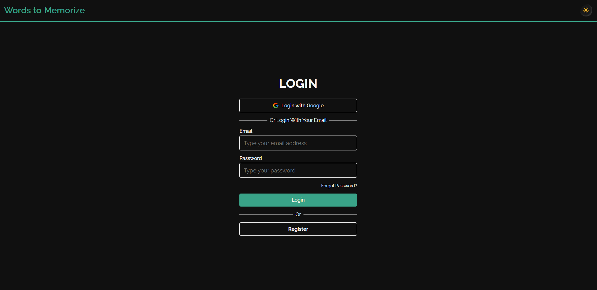
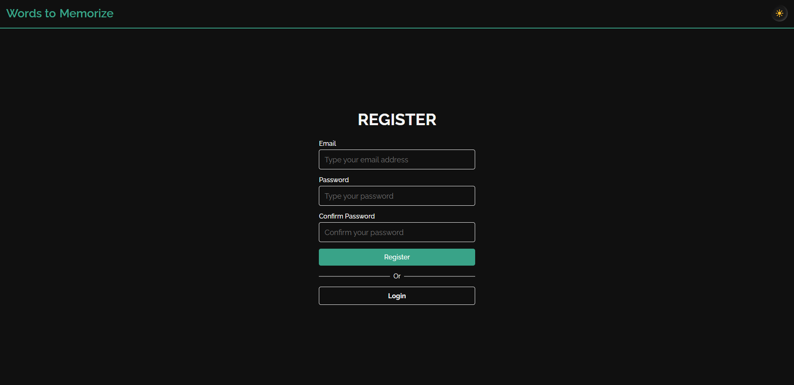
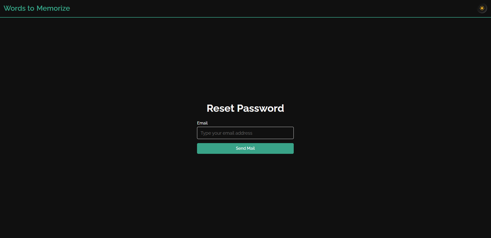
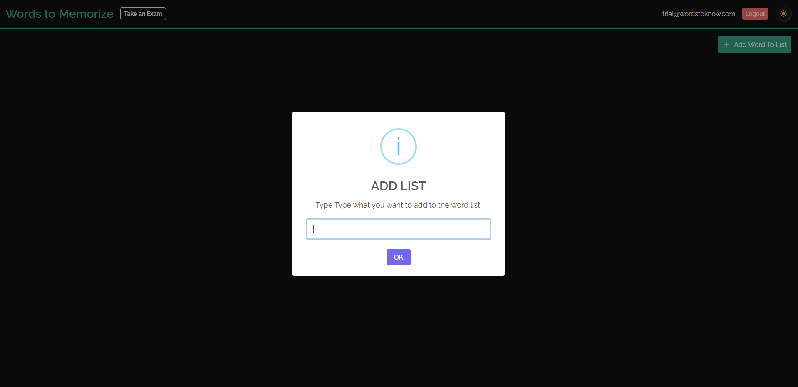
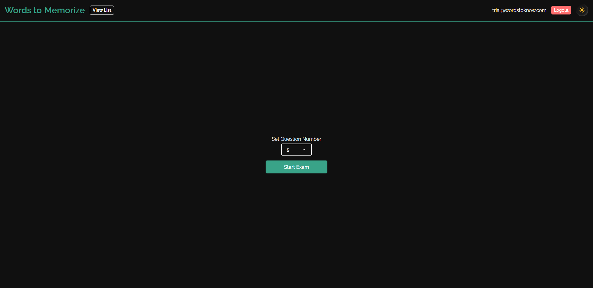
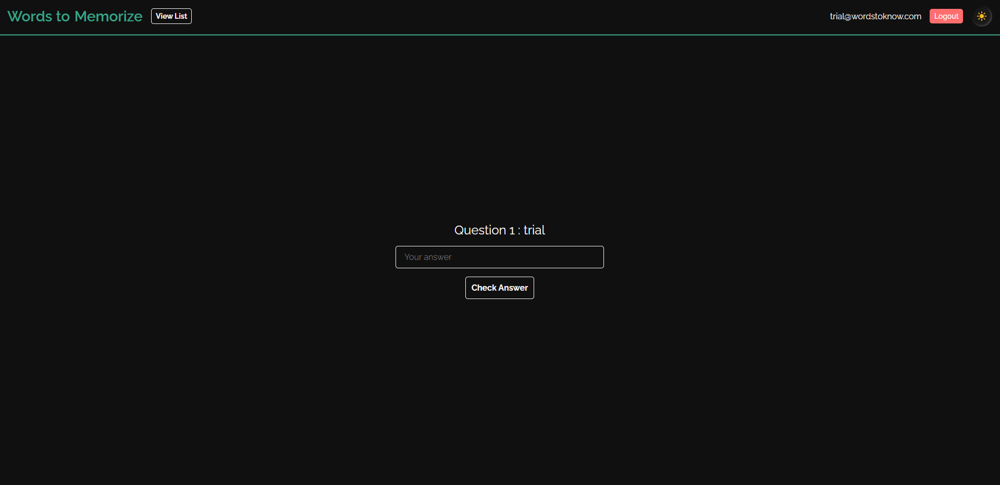
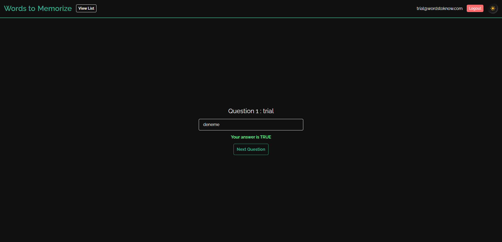
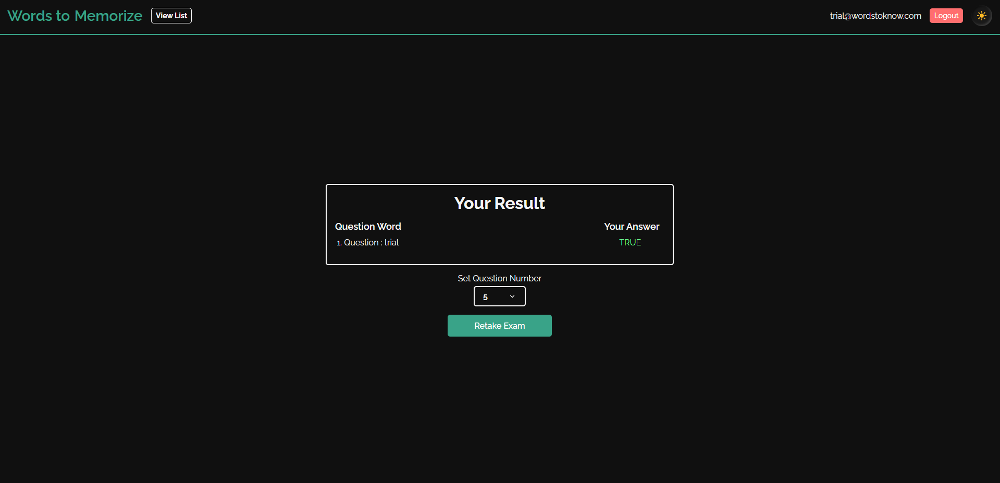
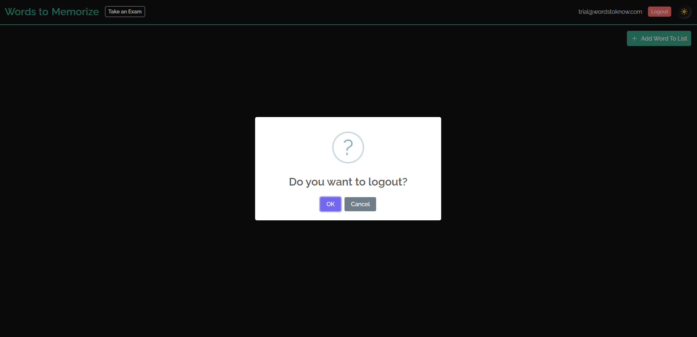

# WORDS TO MEMORIZE

This application was created to make it easier for users who want to memorize words. Application cover only en-tr dictionary for now.

## Features 

You can create an account with your email or you can login easily with Google account. You can add words to your wish list or remove it. Also you can test youself from your wish list.

## Techs

I used Firebase for authentication and store to data. Other techs;

- React JS
- Typescript
- Styled-component
- Redux-toolkit
- Formik
- Yup
- SweetAlert2

## Demo

[Demo](https://words-to-memorize.netlify.app/)

## Installation

If you want to run this app on your local you need to create `.env` file on root directory of project. And fill like this 
```env
// Your Firebase Config 
// You can create an app in Firebase official web site
REACT_APP_apiKey=
REACT_APP_authDomain=
REACT_APP_projectId=
REACT_APP_storageBucket=
REACT_APP_messagingSenderId=
REACT_APP_appId=

// Your Yandex Dictionary Api Key
// You can get one https://yandex.com/dev/dictionary on this link
REACT_APP_dictionaryApiKey=
```


And you are ready to start, just open the terminal and type yarn and checkout localhost:3000 port.

## Screenshots










